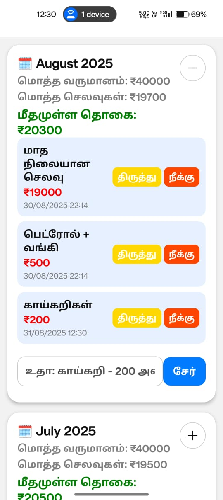

<h1 align="center">Simple Tamil Expense Tracker</h1>

<p align="center">
An intuitive and user-friendly mobile application built with React Native (Expo) to simplify monthly expense and balance tracking for my parents.
</p>

---

## 📝 Project Description

Managing family expenses manually was cumbersome for my parents, as they are not fluent in mobile technology. This app provides a **digital notebook** where they can log expenses easily. Key features include:

- Automatic handling of **recurring monthly expenses** (e.g., ₹19,000).
- Add daily expenses in a simple **Tamil format**, e.g.,  
  `"காய்கறி - 200"` (Vegetables - 200) or `"பால்800"` (Milk 800).
- Automatic calculation of **total expenses and remaining balance**.
- User interface **entirely in Tamil** for accessibility and comfort.
- A practical demonstration of **cross-platform mobile development skills**.

---

## 🚀 How to Clone and Use It

### Prerequisites

- **Node.js & npm** – Latest stable versions.
- **Expo Go app** – To test the application on an Android device.
- **Git** – For cloning the repository.

### Installation & Setup

```bash
# Clone the repository
git clone <Your-Repo-URL>
cd <Your-Repo-Name>

# Install dependencies
npm install

# Start the application
npx expo start
A QR code will appear in your terminal. Scan it with Expo Go to launch the app on your device.
```

## 📁 Folder Structure

```
my-app/
├── assets/                     # App icons, splash screens, etc.
├── components/                 # Reusable React components
│   └── ExpenseCard.js
├── constants/                  # Fixed data and constants
│   └── fixedExpenses.js
├── firebase/                   # Firebase configuration & services
│   ├── firebaseConfig.js
│   └── firebaseService.js
├── services/                   # Backend service functions (optional)
│   └── expenseService.js
├── utils/                      # Utility functions
│   └── parser.js
├── App.js                      # Main application entry point
├── app.json                    # Expo configuration
├── package.json                # Project dependencies
└── README.md                   # Project documentation

```

## ☁️ Firebase Database Initialization
This app uses Firebase Firestore for storing and managing data.

Create a Firebase Project at Firebase Console.

Add a Web App in your project and copy the firebaseConfig object.

## Create firebase/firebaseConfig.js in your project:
```
javascript
import { initializeApp } from 'firebase/app';
import { getFirestore } from 'firebase/firestore';

const firebaseConfig = {
  apiKey: "YOUR_API_KEY",
  authDomain: "YOUR_AUTH_DOMAIN",
  projectId: "YOUR_PROJECT_ID",
  storageBucket: "YOUR_STORAGE_BUCKET",
  messagingSenderId: "YOUR_MESSAGING_SENDER_ID",
  appId: "YOUR_APP_ID"
};

const app = initializeApp(firebaseConfig);
const db = getFirestore(app);
export { db };
Enable Firestore Database in the Firebase console.
```

## 🛠️ Tech Stack
<p align="left"> <a href="https://reactnative.dev/" target="_blank">  </a> <a href="https://expo.dev/" target="_blank">  </a> <a href="https://firebase.google.com/" target="_blank">  </a> <a href="https://day.js.org/" target="_blank">  </a> </p>


## 📱 Application Preview
Here are some screenshots showcasing the app interface and Tamil language support:

<p align="center">   </p>


## ⬇️ Application File (APK)
The Android application file (.apk) has been built using Expo Application Services (EAS).

<p align="center"> <a href="<Your-APK-Download-Link>" target="_blank">  </a> </p>
Share the .apk from your local /builds folder or cloud storage.

## 📝 Summary
This project is more than code—it's a personal solution for my parents to manage finances conveniently. It demonstrates:

Practical problem-solving using technology.

Clean and intuitive UX/UI design for Tamil-speaking users.

Knowledge in React Native, Expo, Firebase, and mobile development.

## 👤 Author

- **Name:** Sriram Venkatesan  
- **Email:** [sriramvenkatesan1604@gmail.com](mailto:sriramvenkatesan1604@gmail.com)  
- **GitHub:** [Click here](https://github.com/sriram1604)

